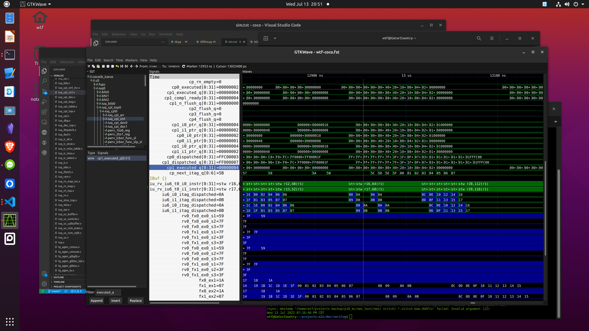

# test3 - kernel+bios+arci

* gen, convert, and link random tst (fx_alucmpbr.tst), and try to run

```
build

# create mem file for coco sim
cp rom.init test3
```

* hanging during results save; itags not executed in cpl queue


