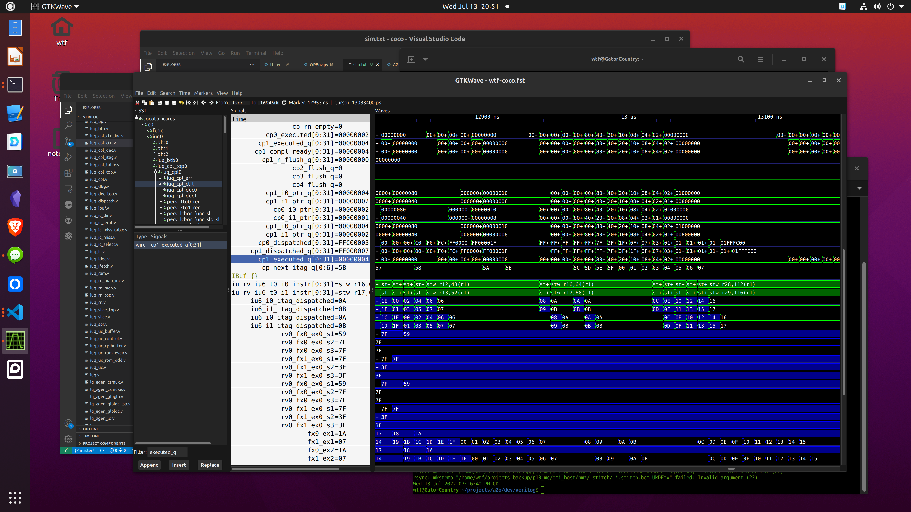

# test3 - kernel+bios+arci

* gen, convert, and link random tst (fx_alucmpbr.tst), and try to run

```
build

# create mem file for coco sim
cp rom.init test3
```

### methodology

1. produce tst.s (stub code and tst definition) and link with kernel/bios
2. tst init is done in tst.s
3. jmp2tst
4. tst ends (bla through kernel, sc, etc.)
5. tst cleanup is done in tst.s
6. tst checking, etc. is done in bios


### debug

* hanging during results save; itags not executed in cpl queue



* itags 07-0B are dispatched but not marked 'executed' in cplq; they were sent to stq

* not documented completely in spec (CPCR2, CPCR3, CPCR4, CPCR5); 2/3 are for hi-pri and 4/5 for med(?)

   ```
   assign spr_t0_cpcr2_fx0_cnt = cpcr2_l2[0][35:39];
   assign spr_t0_cpcr2_fx1_cnt = cpcr2_l2[0][43:47];
   assign spr_t0_cpcr2_lq_cnt = cpcr2_l2[0][51:55];
   assign spr_t0_cpcr2_sq_cnt = cpcr2_l2[0][59:63];
   assign spr_t0_cpcr3_fu0_cnt = cpcr3_l2[0][43:47];
   assign spr_t0_cpcr3_fu1_cnt = cpcr3_l2[0][51:55];
   assign spr_t0_cpcr3_cp_cnt = cpcr3_l2[0][57:63];
   assign spr_t0_cpcr4_fx0_cnt = cpcr4_l2[0][35:39];
   assign spr_t0_cpcr4_fx1_cnt = cpcr4_l2[0][43:47];
   assign spr_t0_cpcr4_lq_cnt = cpcr4_l2[0][51:55];
   assign spr_t0_cpcr4_sq_cnt = cpcr4_l2[0][59:63];
   assign spr_t0_cpcr5_fu0_cnt = cpcr5_l2[0][43:47];
   assign spr_t0_cpcr5_fu1_cnt = cpcr5_l2[0][51:55];
   assign spr_t0_cpcr5_cp_cnt = cpcr5_l2[0][57:63];
   ```

* verilog violation in iuq_dispatch! unused thread 1 strand bits skipping force to 0, and used later as x's for credit checks which didn't stop dispatch

```
//wtf (THREADS1 is def'd)
// iverilog sez: ../../verilog/work/iuq_dispatch.v:2322: warning: @* found no sensitivities so it will never trigger.
// seems to be correct behavior - block won't be entered without a value change
// make it initial, or a generate?
`ifdef THREADS1
   //always @(*)
   initial
```


### printf from litex

add putchar function to store to memory buffer

```
/home/wtf/projects/litex/litex/soc/software/libbase/vsnprintf.c

plus at least these:

from /home/wtf/projects/litex/litex/soc/software/include/base/
#include <stdlib.h>
#include <stdio.h>
#include <stdarg.h>
#include <string.h>
#include <ctype.h>
#include <math.h>
#include <stddef.h>

from /home/wtf/projects/litex/litex/soc/software/include/fdlibm
#include <fdlibm.h>
```

